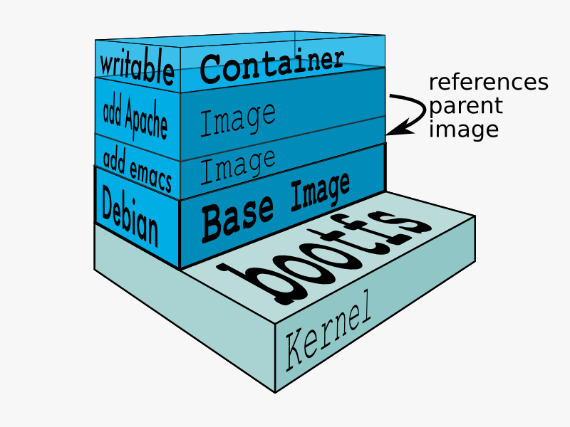

play用户docker入门
=============

为什么要用docker
-----------
我们来看看用docker之前的项目部署

前后端未分离
----------
    1. 部署   本地提交代码   ->  ssh上某一台服务器  -> play dist  -> 
     ssh 上每台需要更新的服务器(可能需要切换nginx的配置) ->  执行自定义的update.sh(停机、替换、启动)
    2. 运维   每台机器弄个定时任务去检查服务是不是挂了，挂了重启之
    3. 扩展   检测集群cpu用量，过高添加机器，否则减少机器(各种云平台有可以简单配置的服务)

前后端分离
------------
    1. 后端部署  同前后端为分离部署模式
    2. 前端部署  本地打包并提交代码 ->  线上自动发布
    3. 运维   每台机器弄个定时任务检查前端代码是否更新，然后直接迁出代码
    4. 扩展   同等同前后端为分离扩展模式

用docker之后
-------------
    1. 部署   本地 sbt docker:publish -> 线上集群自动发布
    2. 运维    无
    3. 扩展   通过简单的webhook即可增加、减少应用数量

综上所述，用docker能极大的减少运维工作、提高效率

docker简介
-----------
一句话介绍:可以使用各种命令和restful api控制的超快“虚拟机”。

    1. 利用linux的内核技术，实现软虚拟机，仅能够运行基于linux的系统
    2. 运行镜像时,可以通过参数改变虚拟机内部的状态，例如环境变量
    3. 使用类git的方式保存、分发、克隆镜像,使镜像可以像源代码一样push  pull clone 以及继承

这些有趣的特性使软件项目有了非常有趣的玩法:

    1. 开发的时候，镜像直接就包含了操作系统，测试、测试环境、生产环境，环境都是一样的，
        可以避免没有装xx库之类的低级错误
    2. 使用环境变量区分不同的环境、设置容易改变的参数，需要修改的时候，仅仅需要修改下参数，重启就好了
    3. 可以大规模的批量部署，仅仅是一个命令的事情，也很容易集中管理
    4. 可以平滑升降级线上环境
    5. 可以很简单的组合互相依赖的服务

docker镜像简介
-----------
docker的镜像和其他虚拟机镜像的区别是，它是分层、只读的。
    但是在镜像被启动运行之后，最上层会附加一层可写的文件系统，运行完毕后会保存为最新的
 一层。类似于git的不同版本一样，历史版本不可修改，但是你可以使用以前的版本创建一个分支 

docker使用Dockerfile来创建镜像，一个web静态网站镜像如下

    ·
    FROM livehl/nginx
    copy ["www/", "/usr/share/nginx/html"]
    EXPOSE 80
    CMD ["/bin/sh","-c", "nginx -g 'daemon off;'"]
    ·
    第一行表示继承自哪个镜像。官方已经打包好了各种操作系统以及常用工具包的镜像，范例表示引用了[docker官方镜像服务](https://hub.docker.com/r/livehl/nginx/)的镜像。
    第二行表示拷贝Dockerfile同目录下的www目录到目标镜像的/usr/share/nginx/html目录下。
    第三行告诉docker，需要开放80端口。
    第四行告诉docker，系统启动后默认执行的命令。
    构建完毕镜像后，就可以启动了。效果即是部署了一个静态的网站。

docker镜像服务简介
-----------
docker镜像创建完毕之后，仅仅是放在了本地，如果需要给其他人或者机器的话，需要一个类似与github一样的镜像管理平台才行，用法也和github差不多。

    1. 创建一个镜像，这时候什么都没有
    2. 镜像发布
        a. 本地构建，push
        b. 自动构建,从github、bitbucket.org拉取git仓库，然后直接构建镜像

    https://hub.docker.com/r/livehl/cow/  这个镜像是由 https://github.com/livehl/cow   这个git库自动构建的，每当git库有更新时，镜像服务商会自动签出最新的
        代码，依据设置自动打包，发布版本
    如果在国外使用，推荐用docker官方的[hub.docker.com](http://hub.docker.com)。国内可以使用阿里云容器和daocloud容器的，速度快。当然项目小还是使用hub.docker.com方便些。
    使用镜像仅仅需要docker pull hub.docker.com/livehl/cow 即可下载到本地，对于hub.docker.com ,可以省略前面的域名，仅仅输入docker pull livehl/cow 即可

docker安装
------------
官网即可下载，国外速度太慢，直接使用[国内镜像地址](http://get.daocloud.io)。选择对应的操作系统即可。

docker运行简介
-----------
docker运行时的虚拟机叫做容器，使用参数可以覆盖镜像内的环境变量、设置网络、内存cpu限制，还能链接其他容器，对于一般应用而言，基本上只需要设置开放端口号、环境变量、链接其他程序
就够了，而且一般不需要手动运行，有集中的管理平台管理。docker运行的详细介绍看[这里](http://dockone.io/article/152)

docker管理简介
-----------
docker最强大的地方是可以通过restful接口管理一个物理机上的所有容器，于是催生出了各种各样的docker管理平台，甚至还有了*容器即服务(Container as a Service)*的概念。
国内技术比较成熟的有daocloud和阿里云；daocloud侧重于企业市场，企业收费个人免费,免费赠送两个低配容器，但是不交费连push镜像的权限都没有。阿里云侧重企业市场，有很强大的扩展功能，需要自配服务器，但是商用不久，还是有各种小bug。
推荐使用阿里云的容器服务，反正免费，而且功能强大。[阿里云容器官方文档](https://help.aliyun.com/product/25972.html)

play2配置docker
-----------
这是专门为play2用户快速使用docker入门的，篇幅可能偏长。操作步骤顺序如下

    0. 使用windows docker 1.12.0的用户注意,需要配置  project/plugins.sbt 
        增加 addSbtPlugin("com.typesafe.sbt" % "sbt-native-packager" % "1.1.4") ,
        否则无法打包(需要克隆git@github.com:swagger-api/swagger-play.git源代码，
        然后到目录play-2.5\swagger-play2>下执行sbt publishLocal)
    1. 注册镜像服务，以阿里云为例,设置仓库密码。在打包环境的docker中执行docker login registry.aliyuncs.com  
    2. 创建新镜像，设置代码源 选择 本地仓库
    3. build.sbt 中添加引用
        `
        import com.typesafe.sbt.packager.docker._
        import NativePackagerHelper._
        `
    4. build.sbt 增加docker插件 ` val root = (project in file(".")).enablePlugins(PlayScala).enablePlugins(DockerPlugin).enablePlugins(JavaAppPackaging) `
    5. build.sbt 增加移除pid设置(如果不设置，容器服务的自动重启特性将会失效)    `javaOptions in Universal ++= Seq("-Dpidfile.path=/dev/null")`
    6. build.sbt 增加以下设置
        `
        dockerBaseImage := "livehl/java8"

        packageName in Docker := packageName.value

        dockerExposedPorts := Seq(9000)

        dockerRepository :=Some("registry.aliyuncs.com/用户名")

        `
        其中用户名替换为镜像服务的用户名
    7. 执行sbt docker:publish  即可将项目发布到镜像服务器

    如果build.sbt中设置 `dockerUpdateLatest in Docker := true` ，则sbt会自动更新latest版本的镜像。配合webhook可以自动更新已经部署的应用

    至此docker镜像构建完了。如果有错误，检查下列问题
    1. 笔者sbt版本 sbt.version=0.13.11  play版本 2.4.x
    2. packageName必须和镜像服务的镜像名字一致
    3. registry.aliyuncs.com/用户名 不需要填写镜像名字  只能是registry.aliyuncs.com/handuser  不能是 registry.aliyuncs.com/handuser/app
    4. 没了，去google你的问题吧。或者来qq群132569382 找子轩

前端后端分离部署
-----------
    很多团队前端和后端是restful接口交互的，开发也是分离的，因此可以完全使用独立的部署方式
        用户->负载均衡->前端集群->nginx->后端集群 or 前端页面
        让用户的请求先经过前端的nginx来决定走向，需要前后端约定好路径，不能有冲突，例如(/api/ 全部转发后端)

    1. 前端添加 Dockerfile文件
            FROM nginx:1.11.0-alpine
            copy ["src/", "/usr/share/nginx/html"]
            copy ["nginx.conf", "/etc/nginx/temp.conf"]
            RUN apk add --no-cache  gettext bash
            EXPOSE 80
            CMD ["/bin/sh","-c", "envsubst '$API' < /etc/nginx/temp.conf > /etc/nginx/nginx.conf && nginx -g 'daemon off;'"]

        或者
            FROM livehl/nginx
            copy ["src/", "/usr/share/nginx/html"]
            copy ["nginx.conf", "/etc/nginx/temp.conf"]
            EXPOSE 80
            CMD ["/bin/sh","-c", "envsubst '$API' < /etc/nginx/temp.conf > /etc/nginx/nginx.conf && nginx -g 'daemon off;'"]
        

    2. 增加nginx.conf文件(只提供location段参考)
        location / {
            root   /usr/share/nginx/html;
            index  index.html index.htm;
        }
        location /api {
            proxy_pass http://${API};
            proxy_set_header Host     $host;
            proxy_set_header X-Real-IP $remote_addr;
        }

    3.创建镜像，使用自动构建，从git中自动构建镜像，并且在指定分支更新之后触发构建操作

    4. 创建前端docker应用时，配置API环境变量，并且指向后端集群(link)

高级特性-多机房部署
-----------
阿里云包含此特性，可以使应用分布在不同的机房中，配合自动迁移做到无运维高可用 [高可用性](https://help.aliyun.com/document_detail/26018.html?spm=5176.doc26043.6.144.QzPsJX)
[重新调度](https://help.aliyun.com/document_detail/26086.html)

高级特性-自动重启
-----------
应用配置的时候设置  restart: always  即可

高级特性-自动发布
-----------
自动发布在不同的平台表现不同，daocloud应用有个设置，设置为自动发布后，该镜像的最新版本push后，会自动更新，不会中断对外的服务

阿里云服务则需要创建应用重新部署的webhook，然后将这个地址填写到镜像服务中，并且play中设置 `dockerUpdateLatest in Docker := true` 
应用镜像使用latest版本即可。另外，阿里云上的应用会中断对外服务，所以至少需要有两个容器实例，并设置健康检查
